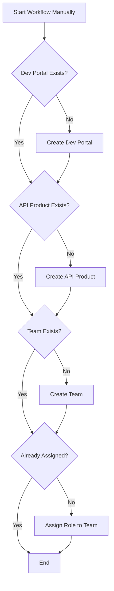
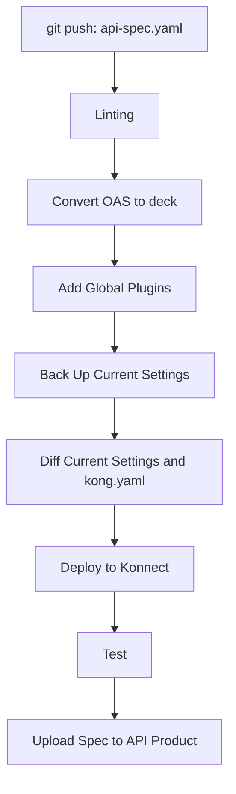
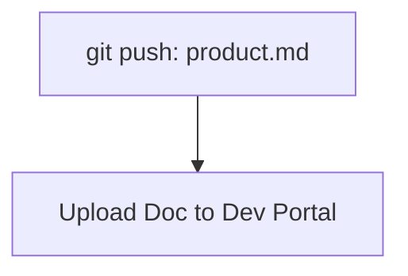

# What's this?
This repository provides a template for APIOps on Konnect. It includes GitHub Actions workflows to automate the lifecycle of your APIs, Developer Portals, and related configurations.

## Workflows
This repository contains the following workflows:

1.  **Create Dev Portal and APIs (`create_portal_api.yaml`)**:
    *   Triggered manually (`workflow_dispatch`).
    *   Creates a new Developer Portal if it doesn't already exist.
    *   Creates a new API Product if it doesn't already exist.
    *   Creates a new Team within the Dev Portal if it doesn't already exist.
    *   Assigns a specified role (`API Consumer` or `API Viewer`) to the Team for the created API.
    *   This workflow is idempotent, meaning it can be run multiple times without causing errors if the resources already exist.

2.  **Deploy OpenAPI Spec (`deploy_oas.yaml`)**:
    *   Triggered on `push` to `docs/openapi/api-spec.yaml`.
    *   Lints the OpenAPI specification.
    *   Converts the OpenAPI spec to declarative configuration (`kong.yaml`).
    *   Applies global plugins for governance.
    *   Deploys the configuration to Konnect Control Plane.
    *   Runs end-to-end tests.
    *   Uploads the API specification to the corresponding API Product in Konnect.

3.  **Upload Documentation (`upload_doc.yaml`)**:
    *   Triggered on `push` to `docs/product.md`.
    *   Uploads the product documentation to the Dev Portal.


|Workflow| User | Trigger|
|---|---|---|
|create_portal_api.yaml| Konnect Admin | When providing an environment to developers（Frequency: Low）|
|deploy_oas.yaml| API Developer | During development（Frequency: High）|
|upload_doc.yaml| API Developer | During development（Frequency: High）|
|upload_spec.yaml| API Developer | During development（Frequency: High）|

This is a sample, so all code is stored in a single repository. However, as a best practice, it is recommended to separate the code repositories used by Admin and Developer.

## Flow Diagram

### Manual Trigger: Create Portal and API


### Automated Trigger: OpenAPI Spec Change


### Automated Trigger: Documentation Change



## Prerequisite

The following items should be prepared in Konnect:
- A Control Plane.

The directory structure should be as follows:
```sh
.
├── docs
│   ├── openapi
│   │   └── api-spec.yaml
│   └── product.md
```

The following in Konnect should be prepared in advance.
- Control Plane
- Dev Portal

# How to use
## 1. Set Repository Secret and Environment variables
```sh
# Konnect Token
gh secret set KONNECT_TOKEN --body "spat_7f4IKi5g...."
```

```sh
# Konnect Region
gh variable set KONNECT_REGION -b "us"
# Control Plane
gh variable set CONTROL_PLANE -b "default"
# Dev Portal Name
gh variable set PORTAL_NAME -b "default-dev-portal"
# API Name
gh variable set PRODUCT_NAME -b "httpbin"

# Tag to identify it from other entities.
gh variable set TAG -b "httpbin"
```

### 2. Run a Workflow

#### Create Dev Portal and APIs
1.  Go to the "Actions" tab in your GitHub repository.
2.  Select the "Create Dev Portal and APIs" workflow.
3.  Click "Run workflow".
4.  Fill in the required inputs:
    - **APIs Name**: Name of the API Product.
    - **APIs Version**: Version of the API Product.
    - **Dev Portal Name**: Name of the Developer Portal.
    - **Team Name**: Name of the team to be created.
    - **Team Role**: Role to assign to the team (`API Consumer` or `API Viewer`).
5.  Click "Run workflow".

#### Deploy OpenAPI Spec or Documentation
- To trigger the `deploy_oas.yaml` workflow, commit and push changes to `docs/openapi/api-spec.yaml`.
- To trigger the `upload_doc.yaml` workflow, commit and push changes to `docs/product.md`.

### 3. (Optional) Use a Custom Container Image

To speed up the workflows, you can use a custom Docker image with all necessary packages pre-installed.

**Build and Push Docker Image:**
```sh
DOCKER_REPOSITORY=your_docker_hub_username/your_image_name
docker build -t $DOCKER_REPOSITORY .
docker push $DOCKER_REPOSITORY
```

After pushing the image, modify the `container.image` property in the workflow files (`.github/workflows/*.yaml`) to point to your new image.
Example: `container: image: your_docker_hub_username/your_image_name:latest`