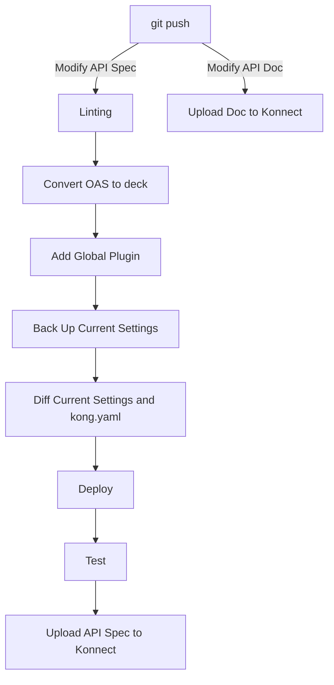

# What's this?
This repository is a template for APIOps in Konnect.

When the API Spec is updated, after validating the API Spec, the Service and Route are created in Konnect.
At that time, a Global Plugin is automatically added to enforce the organization's governance.
After creation, a test script is executed, and if no issues are found, the Spec documentation associated with the API is updated.

When the API documentation is updated, only the API documentation is uploaded.

It provides the following flow.




# Prerequisite and Limitation
The API Product documentation and OpenAPI Spec should be located as follows.
```sh
.
├── docs
│   ├── openapi
│   │   └── api-spec.yaml
│   └── product.md
```

The following in Konnect should be prepared in advance.
- Control Plane
- Dev Portal

# How to use
## 1. Set Repository Secret and Environment variables
```sh
# Konnect Token
gh secret set KONNECT_TOKEN --body "spat_7f4IKi5g...."
```

```sh
# Konnect Region
gh variable set KONNECT_REGION -b "us"
# Control Plane
gh variable set CONTROL_PLANE -b "default"
# Dev Portal Name
gh variable set PORTAL_NAME -b "default-dev-portal"
# API Name
gh variable set PRODUCT_NAME -b "httpbin"
# Tag to identify it from other entities.
gh variable set TAG -b "httpbin"
```

## 2. Use Own Container Image　（Optional)

Currently, packages are being installed within the job. However, if you wish to complete the job faster, you can create an image using the following steps and stop installing packages.

### Build and Push Docker Image

```sh
DOCKER_REPOSITORY=your_repository
docker build -t $DOCKER_REPOSITORY --platform linux/x86_64 .
docker push $DOCKER_REPOSITORY
```
After building image, modify `jobs.<job name>.container.image` to `<your_repository>`.

### Modify container image name　in workflows dir.

You modify the job and change the flow to use the created image.

## 3. Run Workflow
If you update `api-spec.yaml`, GitHub Runner runs `deploy_oas.yaml` and `upload_spec.yaml`.
After validating the Spec, the Service or Route is created and the API Spec file is uploaded.
If you update `product.md`, GitHub Runner runs `upload_doc.yaml`.
`product.md` is uploaded.